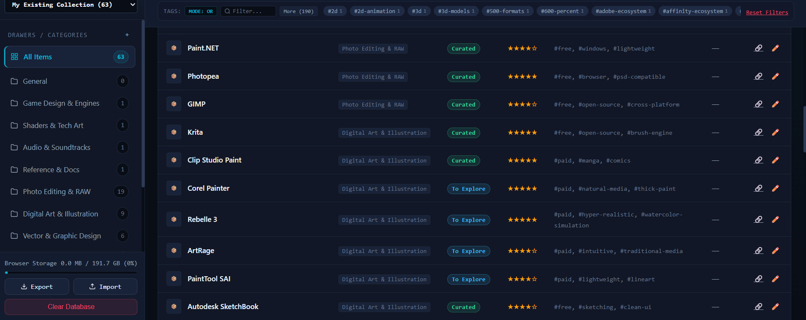
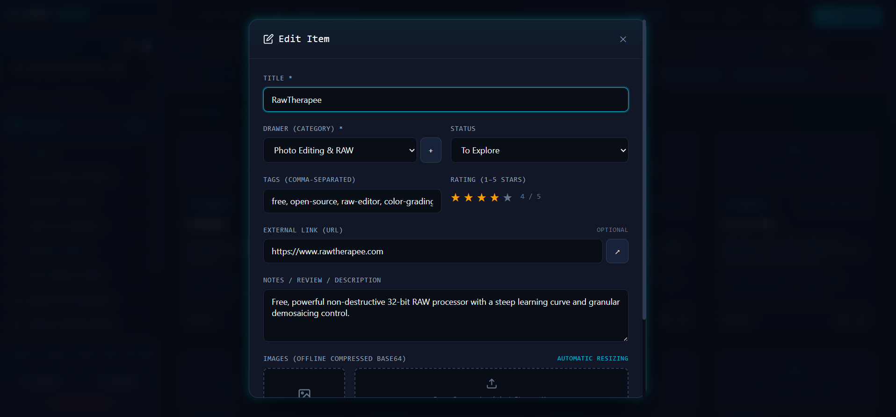

# CURIO — The Curator

An offline-first, high-capacity visual catalog, asset organizer, and curation dashboard designed for game developers, digital artists, researchers, and creators.

[%20v1.0-0078D6?style=for-the-badge&logo=windows&logoColor=white)](CURIO-v1.0-Windows.zip)

[-06B6D4?style=flat-square)](app.html)

> 🚀 **Launch the Web App**: [https://fahimarnob113-ctrl.github.io/Curio--The-Curator/app.html](https://fahimarnob113-ctrl.github.io/Curio--The-Curator/app.html)  
> 🪟 **Download Desktop App (v1.0)**: [CURIO-v1.0-Windows.zip](CURIO-v1.0-Windows.zip)  
> 🌐 **Official Website**: [https://fahimarnob113-ctrl.github.io/Curio--The-Curator/](https://fahimarnob113-ctrl.github.io/Curio--The-Curator/)

---

## 📥 Download & Platform Formats

| Platform | Format | Package Size | Download Link |
| :--- | :--- | :--- | :--- |
| **🌐 Live Web App** | Browser (PWA) | `0 MB` (Instant) | [Launch Online](https://fahimarnob113-ctrl.github.io/Curio--The-Curator/app.html) |
| **🪟 Windows Desktop** | Standalone `.exe` | `1.15 MB` | [Download Windows .zip](CURIO-v1.0-Windows.zip) |
| **🐧 Linux Desktop** | Standalone `x64` | `708 KB` | [Download Linux .zip](CURIO-v1.0-Linux-x64.zip) |
| **🍎 macOS Desktop** | Universal Binary | `1.40 MB` | [Download macOS .zip](CURIO-v1.0-macOS-Universal.zip) |
| **📄 Single-File HTML** | Offline HTML5 | `~1 MB` | [Download .html](app.html) |

---

## 🌟 What is CURIO?

**CURIO** is a lightweight, zero-dependency curation workbench that lives in a single standalone HTML file. It allows you to collect, review, tag, rate, and organize software tools, digital assets, documentation, shaders, audio packs, and creative workflows with zero server setup.

Unlike traditional cloud bookmarkers or notes apps, CURIO runs completely on your local machine, persists data in high-capacity **IndexedDB**, and packages backups into clean **`.zip` archives** containing both your structured JSON metadata and actual image files.

---

## 👥 Who is CURIO For? (Target Audience Matrix)

| Audience Persona | Primary Use Case in CURIO | Pre-Loaded Catalogs Included |
| :--- | :--- | :--- |
| **🎮 Game Developers & Tech Artists** | Tool curation, shader math reference, engine tracking & gaming history | *Game Dev & Tech Art*, *Games Master List (246)* |
| **🎨 Digital Artists & Animators** | Brush engines, vector/raster tools, animation timelines & proof-sheets | *Creative Software & Design*, *Anime & Manga Eras* |
| **💻 Software Engineers & SysAdmins** | OS lineages, desktop utilities, Linux distros & smartphone hardware evolution | *OS Version Histories*, *Windows Software*, *Smartphones (2004–2024)* |
| **🏛️ Writers, Worldbuilders & Historians** | Deep lore reference, mythologies, world history, civilizations & pantheons | *Historical Figures*, *Mythological Figures*, *Historical Eras*, *World Religions* |
| **🌿 Biologists, Students & Educators** | Taxonomic hierarchies, biome reference decks & academic archives | *World Biomes & Ecosystems*, *Animal Kingdom Classifications* |
| **🛡️ Privacy Enthusiasts & Self-Hosters** | Zero-cloud, 100% offline knowledge base with gigabyte IndexedDB storage | *All 15 Catalogs (1,366+ entries)* |

---

## 🎯 Practical Use-Cases & Workflows

### 🎮 1. Game Development & Tech Art Knowledge Hub
- **Game Engines & Frameworks**: Track engine features (Godot 4.3, Unreal, Unity, Bevy, Raylib) with licensing notes, rendering backends, and version compatibility.
- **Shaders & VFX Reference**: Catalog GLSL/HLSL raymarching algorithms, signed distance functions (SDFs), compute shaders, and procedural noise libraries.
- **Gaming History & Mechanical Reference**: Explore a 246-game encyclopedia across 23 eras and consoles (Arcade, NES, SNES, PS1/PS2, GBA, DS, modern 9th Gen, Indies, and MAME staples).
- **Audio & Soundtracks**: Curate retro synthwave OSTs, procedural sound generators, and middleware soundbanks.

### 🎨 2. Digital Art, Animation & Creative Suite
- **Painting & Inking Arsenals**: Compare specialized brush engines (Krita, Clip Studio Paint, Corel Painter, Rebelle, PaintTool SAI).
- **Vector & UI Workbenches**: Organize vector/pixel hybrid tools (Affinity Designer 2, Inkscape, CorelDRAW, Boxy SVG).
- **Anime & Manga History**: Browse 87 pivotal titles and milestones from the 1900s foundational era through the 80s cyberpunk boom and modern global streaming hits.
- **Pixel Art & Spriting**: Manage sprite animation tools (Aseprite, GraphicsGale, Pixelorama, Piskel).

### 💻 3. Software Engineering, OS Lineages & Retro Tech
- **Operating System History**: Review chronological version tables for Windows (1.0 to 11), Mac OS (System 1 to Sequoia 15), Android (1.5 to 15), iOS (1 to 18), and 14 major Linux distributions.
- **Windows Software Archive**: Catalog 87 built-in apps, system utilities, retro media players, and security tools.
- **Two Decades of Mobile Tech (2004–2024)**: Track 51 iconic smartphones and feature phones, from the Nokia 3310 and RAZR V3 through the iPhone boom, foldables, and major controversies (Antennagate, Note 7, Batterygate).

### 🏛️ 4. Worldbuilding, History & Creative Writing
- **Mythological Pantheons**: Reference 164 deities, heroes, and creatures across 10 mythological traditions (Greek, Roman, Norse, Egyptian, Hindu, Celtic, Shinto, Chinese, Mesopotamian, Mesoamerican).
- **Historical Figures & Civilizations**: Quick-reference 158 influential rulers, philosophers, scientists, and reformers alongside 128 global historical eras.
- **World Religions & Global Systems**: Access comparative summaries of major belief systems, international governance bodies (UN, IMF, WTO, NATO), and regional trade blocs.

### 🌿 5. Earth Sciences & Biological Taxonomy
- **World Biomes & Ecosystems**: Reference climate traits and geographic examples across terrestrial and aquatic ecosystems (Taiga, Rainforests, Tundra, Chaparral, Coral Reefs, Abyssal zones).
- **Animal Kingdom Classifications**: Browse taxonomic ranks from domain down to major invertebrate phyla, chordate classes, and animal orders.

---

## ⚡ Core Features

- **🗂️ Multi-Catalog Switching**: Switch instantly between independent catalogs (*Creative Tools*, *Game Dev*, *Combined Library*) with separate drawers, tags, and search scopes. Create, rename, or delete catalogs at will.
- **💾 Gigabyte-Scale Local Storage (IndexedDB)**: Bypasses restrictive 5MB browser `localStorage` limits with native **IndexedDB (`CyberDB`)**. Upload high-resolution screenshot galleries and logos stored permanently on your disk.
- **📦 True ZIP Archive Backup & Universal Restore**:
  - **Export (`.zip`)**: Bundles metadata (`catalogs.json`) and extracts all uploaded image Blobs into real `.jpg`/`.png` files in an `/images/` subfolder.
  - **Universal Import**: Drop either a `.zip` archive or `.json` file to restore your entire database seamlessly.
- **🎛️ 4 Switchable View Modes**:
  - **Grid View**: Visual card matrix with tags, rating stars, and instant edit actions.
  - **Detailed View**: Expanded two-column layout showing multi-photo galleries and comprehensive notes.
  - **List View**: Dense tabular view for quick scanning and metadata comparison.
  - **Kanban Board**: Workflow pipeline (*To Explore*, *In Progress*, *Curated*, *Archived*) with independent column scrolling.

| Grid Gallery | Kanban Workflow |
| :---: | :---: |
|  |  |

| Detailed List | Edit & Curate Dialog |
| :---: | :---: |
|  |  |

- **🎨 5 Cyberpunk & Minimalist Themes**: Switch between *Cyber Cyan* (default), *Synthwave Sunset*, *Matrix Terminal*, *Nord Frost*, and *Midnight Gold* with instant theme persistence.
- **⚙️ Settings Hub & Live Stats HUD**: Real-time storage estimation, catalog counters, and shortcuts cheatsheet.
- **🏷️ Scoped Tag Cloud with Live Search**:
  - Contextual tag strip that adapts to the currently active drawer.
  - Instant tag search box (`Filter...`) with expand/collapse view and item frequency badges.
- **⌨️ Speed & Accessibility**: Full keyboard navigation (`/` to focus search, `N` for new item, `Esc` to dismiss modals).

---

## 🚀 Getting Started & Live Demo

- **🌐 Live Demo (GitHub Pages)**: [https://fahimarnob113-ctrl.github.io/Curio--The-Curator/](https://fahimarnob113-ctrl.github.io/Curio--The-Curator/)
- **💻 Run Locally**:
  1. Clone this repository: `git clone https://github.com/fahimarnob113-ctrl/Curio--The-Curator.git`
  2. Double-click `index.html` in your browser.
  3. No build step, node modules, or server required!

---

## 🗃️ Included Pre-Loaded Catalogs (1,366 Items Across 15 Catalogs)

CURIO comes pre-loaded with comprehensive reference libraries:

1. **🎨 Creative Software & Design Tools (59 Items / 7 Drawers)**
   - *Photo Editing & RAW, Digital Art & Illustration, Vector Design, Publishing, Asset Managers, Pixel Art, HDR & AI Plugins.*
2. **🎮 Games Master List (246 Items / 23 Eras & Platforms)**
   - *Arcade, 8-bit, 16-bit, 5th Gen (PS1/N64), 6th Gen (PS2/GameCube), GBA, 7th Gen, DS, 8th Gen, Modern 9th Gen, Indie Standouts, Mobile, J2ME, E-Sports, RPGs, MMORPGs, PC Golden Age, Racing, VR, Dreamcast, Neo Geo, UGC, MAME Classics.*
3. **📱 Smartphones & Feature Phones: 2004-2024 (51 Items / 8 Eras)**
   - *Feature Phone Era, iPhone/Android Launch, Smartphone Boom, Peak Wars, Notch & Foldables, Recent Era (2021-2024), Major Controversies (Antennagate, Note 7, Batterygate, US Huawei Ban), and Modern Minimalist Dumbphones.*
4. **💻 Operating System Version Histories (64 Items / 5 Families)**
   - *Windows (1.0 to 11), Mac OS (System 1 to Sequoia 15), Android (1.5 Cupcake to 15), iOS (1 to 18), and Major Linux Distributions (Debian, Arch, Ubuntu, Mint, Fedora, RHEL, Pop!_OS, SteamOS, Gentoo, Kali, Alpine).*
5. **🪟 Windows Software: Built-in & Iconic Apps (87 Items / 8 Drawers)**
   - *Built-in Windows Apps, Productivity & Office, Web Browsers & Communication, Media Players & Audio, Creativity & Design, System Utilities & Tools, Compression & File Management, Security & Anti-Malware.*
6. **🎌 Anime & Manga Eras & Iconic Titles (87 Items / 11 Drawers)**
   - *Foundational Era (1900s-1950s), TV Anime Begins (1960s), Mecha & Sci-Fi Boom (1970s), Golden Age & Cyberpunk (1980s), 90s Explosion & Modern Classics, 2000s Mainstream Era, 2010s Streaming Boom, 2020s Contemporary Hits, Defining Manga, Iconic Anime Studios, Influential Creators.*
7. **🏛️ Historical Figures Across Civilizations (158 Items / 19 Drawers)**
   - *Ancient Mesopotamia & Near East, Ancient Egypt, Ancient Greece, Ancient Rome, Ancient & Classical India, Ancient & Imperial China, Islamic Golden Age, Medieval & Renaissance Europe, Early Modern to 19th Century, 20th Century & Modern Era, Pre-Columbian Americas & Africa.*
8. **⚡ Mythological Figures Across World Traditions (164 Items / 21 Drawers)**
   - *Greek, Roman, Norse, Egyptian, Hindu, Celtic, Japanese (Shinto), Chinese, Mesopotamian, and Mesoamerican Mythologies & Legendary Beings.*
9. **📜 Historical Eras & Civilizations (128 Items / 17 Drawers)**
   - *Prehistory, Ancient Near East & Mesopotamia, Ancient Egypt & Levant, Classical Greece & Hellenistic, Ancient Rome, Ancient & Classical India, Ancient & Imperial China, Post-Classical Middle East, Medieval Europe, Renaissance, Early Modern, Industrial & Modern Era.*
10. **🕊️ World Religions & Belief Systems (66 Items / 11 Drawers)**
    - *Abrahamic Religions, Dharmic Religions (Hinduism, Buddhism, Jainism, Sikhism), East Asian Traditions (Taoism, Confucianism, Shinto), Iranian Traditions (Zoroastrianism), Indigenous & Folk Traditions, Esoteric Movements.*
11. **🌐 World Organizations (87 Items / 12 Drawers)**
    - *United Nations System, Global Governance & Finance (IMF, World Bank, WTO), Military Alliances (NATO), Regional Political Blocs (EU, ASEAN, AU), Trade Blocs (OPEC, USMCA), Justice & Human Rights (ICC, Amnesty).*
12. **🌲 World Biomes & Ecosystems (39 Items / 11 Drawers)**
    - *Forest Biomes (Tropical, Deciduous, Taiga/Boreal), Grasslands & Savannas, Deserts & Shrublands, Tundra & Polar, Freshwater Aquatic Biomes, Marine Aquatic Biomes, Transitional Wetlands.*
13. **🐾 Animal Kingdom Classifications (63 Items / 11 Drawers)**
    - *Taxonomic Hierarchy, Major Invertebrate Phyla, Chordate Classes (Fish, Amphibians, Reptiles, Birds, Mammals), and Notable Mammalian & Avian Orders.*
14. **🕹️ Game Dev & Tech Art (4 Items / 4 Drawers)**
    - *Game Design & Engines, Shaders & Tech Art, Audio & Soundtracks, Reference & Docs.*
15. **📚 Full Combined Library (63 Items / 11 Drawers)**

---

## ⌨️ Keyboard Shortcuts

| Shortcut | Description |
| :---: | :--- |
| / | Focus global search box |
| N / Ctrl+N | Open New Item curation modal |
| Escape | Dismiss active modal, drawer settings, or lightbox |
| ◀ / ▶ | Navigate lightbox gallery images |

---

## 📄 License

Distributed under the **MIT License**. Free for personal and commercial use.
